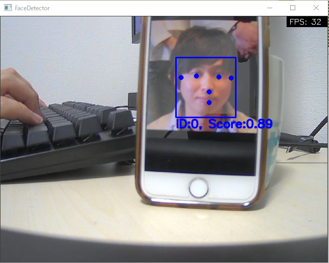
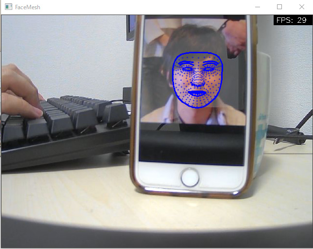
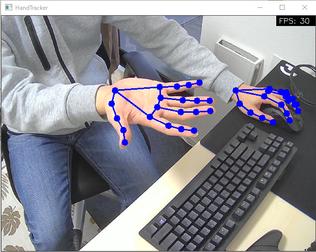
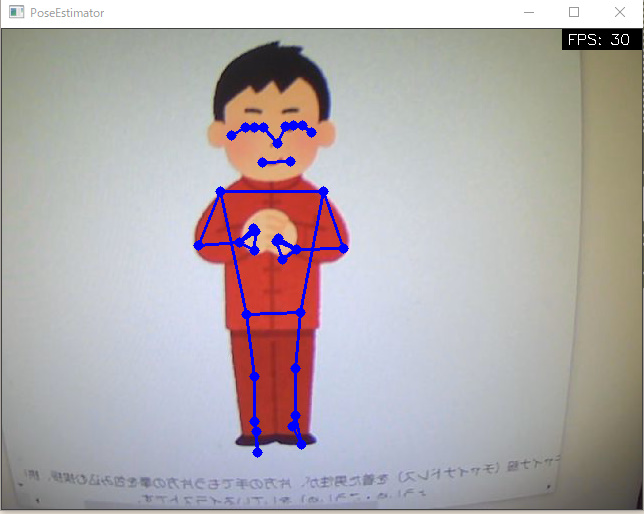
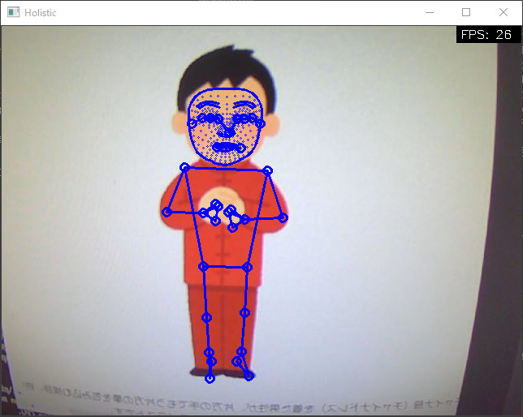
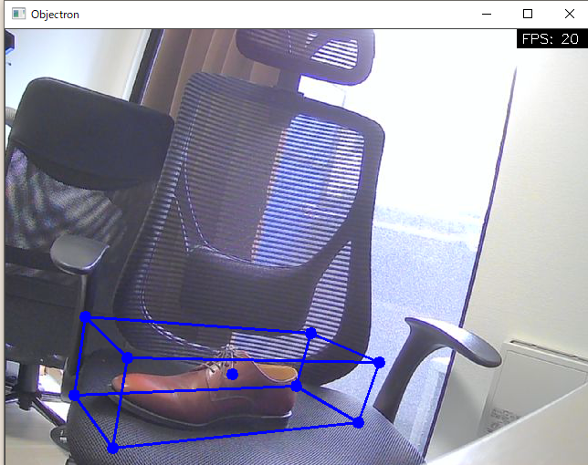

# mediapipe_python4windows
MediaPipeがサポートしているPythonパッケージをWindowsで動かしたサンプルです。

実行時のサブコマンドで以下6種類のモデルを動かすことが可能です。（詳細は[Usage](#Usage)を確認ください）

|  Face Detection  |  Face Mesh  |
| :----: | :----: | 
|  |    |
|  **Hands**  |  **Pose**  |
|  |    |
|  **Holistic**  |  **Objectron**  |
|  |    |

# Environment
- Windows 10 home Insider Preview 10.0.21327 build 221327
  - Core(TM) i7-9700K CPU @ 3.60GHz
- Anaconda 4.8.2
- Web Camera

# Requirement
- mediapipe==0.8.3.1
- opencv-python==4.5.1.48


# Usage
## Setup
```
(base) $ git clone https://github.com/T-Sumida/mediapipe_python4windows.git
(base) $ conda create -n mediapipe python=3.7
(base) $ conda activate mediapipe
(mediapipe) $ conda install requests
(mediapipe) $ pip install mediapipe, loguru
```

## Demo

mediapipe_sample.py 実行時のサブコマンドで、MediaPipeがサポートしているモデルを指定して実行することができる。

2021/4/18現在、mediaPipeがPythonでサポートしているモデルは、
- Face Detection
- Face Mesh
- Hands
- Pose
- Holistic
- Objectron

（サポートについては、[こちら](https://github.com/google/mediapipe)をご確認ください。）


```
(mediapipe) $ python mediapipe_sample.py -h
usage: mediapipe_sample.py [-h] [--device DEVICE] [--width WIDTH]
                           [--height HEIGHT]
                           {FaceDetector,FaceMesh,HandTracker,PoseEstimator,Objectron,Holistic}
                           ...

positional arguments:
  {FaceDetector,FaceMesh,HandTracker,PoseEstimator,Objectron,Holistic}
    FaceDetector
    FaceMesh
    HandTracker
    PoseEstimator
    Objectron
    Holistic

optional arguments:
  -h, --help            show this help message and exit
  --device DEVICE       device id
  --width WIDTH         capture width
  --height HEIGHT       capture height
```

### Face Detection
顔のランドマークを取得するサンプル。
```
(mediapipe) $ python mediapipe_sample.py FaceDetector -h
usage: mediapipe_sample.py FaceDetector [-h]
                                        [--min_detection_confidence MIN_DETECTION_CONFIDENCE]

FaceDetector

optional arguments:
  -h, --help            show this help message and exit
  --min_detection_confidence MIN_DETECTION_CONFIDENCE
                        顔検出モデルの最小信頼値 [0.0, 1.0]
```

Example
```
(mediapipe) $ python mediapipe_sample.py FaceDetector
```


### Face Mesh
顔のメッシュを取得するサンプル
```
(mediapipe) $ python mediapipe_sample.py FaceMesh -h
usage: mediapipe_sample.py FaceMesh [-h] [--max_num_faces MAX_NUM_FACES]
                                    [--min_detection_confidence MIN_DETECTION_CONFIDENCE]
                                    [--min_tracking_confidence MIN_TRACKING_CONFIDENCE]

FaceMesh

optional arguments:
  -h, --help            show this help message and exit
  --max_num_faces MAX_NUM_FACES
                        最大検出顔数
  --min_detection_confidence MIN_DETECTION_CONFIDENCE
                        顔検出モデルの最小信頼値 [0.0, 1.0]
  --min_tracking_confidence MIN_TRACKING_CONFIDENCE
                        ランドマーク追跡モデルの最小信頼値 [0.0, 1.0]
```
Example
```
(mediapipe) $ python mediapipe_sample.py FaceMesh
```


### Hands
手のランドマークを取得するサンプル。
```
(mediapipe) $ python mediapipe_sample.py HandTracker -h
usage: mediapipe_sample.py HandTracker [-h] [--max_num_hands MAX_NUM_HANDS]
                                       [--min_detection_confidence MIN_DETECTION_CONFIDENCE]
                                       [--min_tracking_confidence MIN_TRACKING_CONFIDENCE]

HandTracker

optional arguments:
  -h, --help            show this help message and exit
  --max_num_hands MAX_NUM_HANDS
                        最大検出手数
  --min_detection_confidence MIN_DETECTION_CONFIDENCE
                        手検出モデルの最小信頼値 [0.0, 1.0]
  --min_tracking_confidence MIN_TRACKING_CONFIDENCE
                        ランドマーク追跡モデルの最小信頼値 [0.0, 1.0]
```
Example
```
(mediapipe) $ python mediapipe_sample.py HandTracker
```


### Pose
人の骨格を取得するサンプル。
```
(mediapipe) $ python mediapipe_sample.py PoseEstimator -h
usage: mediapipe_sample.py PoseEstimator [-h]
                                         [--min_detection_confidence MIN_DETECTION_CONFIDENCE]
                                         [--min_tracking_confidence MIN_TRACKING_CONFIDENCE]

PoseEstimator

optional arguments:
  -h, --help            show this help message and exit
  --min_detection_confidence MIN_DETECTION_CONFIDENCE
                        姿勢推定モデルの最小信頼値 [0.0, 1.0]
  --min_tracking_confidence MIN_TRACKING_CONFIDENCE
                        ランドマーク追跡モデルの最小信頼値 [0.0, 1.0]
```
Example
```
(mediapipe) $ python mediapipe_sample.py PoseEstimator
```


### Holistic
上記のFace Mesh、Hands、Poseを1つにまとめたサンプル。
```
(mediapipe) $ python mediapipe_sample.py Holistic -h
usage: mediapipe_sample.py Holistic [-h]
                                    [--min_detection_confidence MIN_DETECTION_CONFIDENCE]
                                    [--min_tracking_confidence MIN_TRACKING_CONFIDENCE]

Holistic

optional arguments:
  -h, --help            show this help message and exit
  --min_detection_confidence MIN_DETECTION_CONFIDENCE
                        人物検出モデルの最小信頼値 [0.0, 1.0]
  --min_tracking_confidence MIN_TRACKING_CONFIDENCE
                        ランドマーク追跡モデルの最小信頼値 [0.0, 1.0]
```
Example
```
(mediapipe) $ python mediapipe_sample.py Holistic
```


### Objectron
3D物体検出のサンプル。
```
(mediapipe) $ python mediapipe_sample.py Objectron -h
usage: mediapipe_sample.py Objectron [-h] [--max_num_objects MAX_NUM_OBJECTS]
                                     [--min_detection_confidence MIN_DETECTION_CONFIDENCE]
                                     [--min_tracking_confidence MIN_TRACKING_CONFIDENCE]
                                     [--model_name MODEL_NAME]

Objectron

optional arguments:
  -h, --help            show this help message and exit
  --max_num_objects MAX_NUM_OBJECTS
                        最大検出物体数
  --min_detection_confidence MIN_DETECTION_CONFIDENCE
                        物体検出モデルの最小信頼値 [0.0, 1.0]
  --min_tracking_confidence MIN_TRACKING_CONFIDENCE
                        ランドマーク追跡モデルの最小信頼値 [0.0, 1.0]
  --model_name MODEL_NAME
                        モデル名 {Shoe, Chair, Cup, Camera}
```
Example
```
(mediapipe) $ python mediapipe_sample.py Objectron --model_name Shoe
```


# Author
T-Sumida
